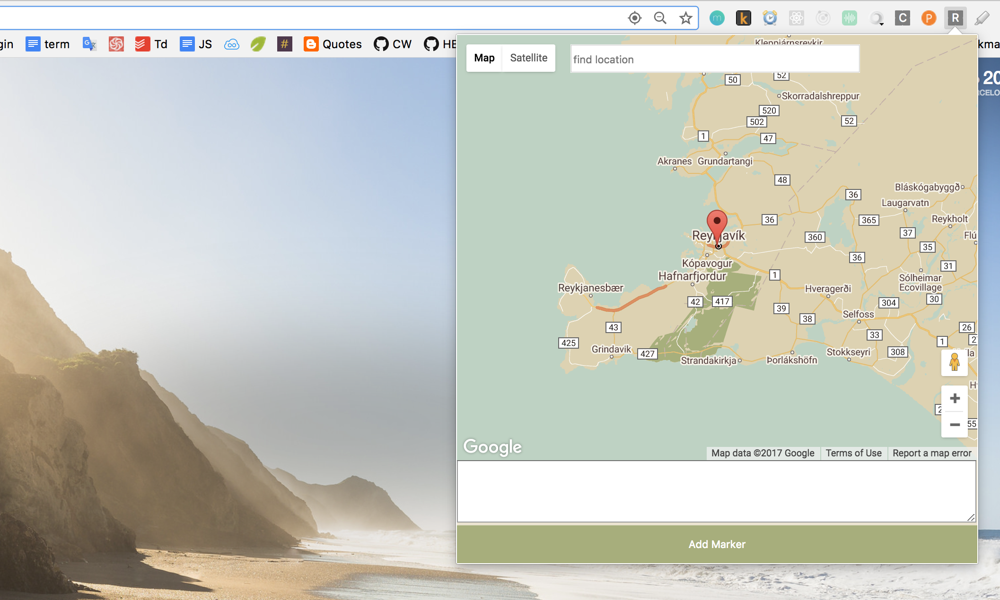
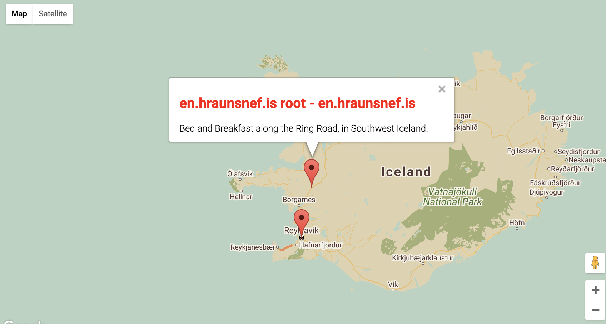

# Map Marklet

Map Marklet is a Chrome extension that lets users save urls to markers on a personal instance of Google Maps.

## Motivation

While planning for road trips, I often save bookmarks to many websites which I then reference later. However, it's difficult to know the locations the websites refer to. This Chrome extension helps users locate the places that the websites refer to on a map.

## Installation
- Clone the repo and run `npm i`
- `gulp watch`
- In Chrome, More tools > Extensions, select developer mode.
- Click button 'Load unpacked extension' and select the build folder.

## Tech Stack
- React + Redux
- Google Maps Api
- Chrome Api
